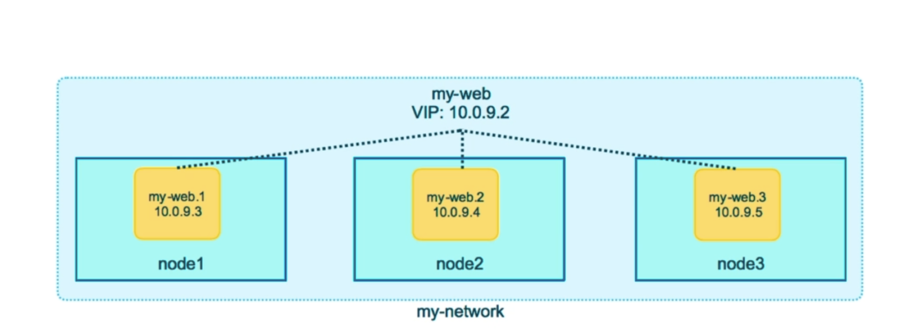

# Docker Swarm

To test out docker swarm features or learn docker swarm, you can use below website(playground)
which allows you to run a swarm cluster on cloud for free (for 4 hours). All you need is a docker
account. 

[Click here to open playground](https://labs.play-with-docker.com/)

You can also use swarm visualizer while you are learning docker swarm to look at swarm cluster through a GUI.
Command to start swarm visualizer:

```docker service create --name=viz --publish=8080:8080/tcp --constraint=node.role==manager --mount=type=bind,src=/var/run/docker.sock,dst=/var/run/docker.sock bretfisher/visualizer```

## Contents

- [TODO](#todo)
- [General](#General)
- [Manager](#Manager)
- [Worker](#Worker)
- [Routing Mesh](#Routing-mesh)
- [Stacks](#Stacks)
- [Container Placement](#container-placement)
- [Commands](#Commands)

### TODO

- [ ] Check if swarm visualizer is needed to keep an eye on cluster.

### General

- Any node (manager/worker) can be promoted or demoted to other roles.
- Replicas are also known as tasks. 
- When you initialize docker swarm:
    - docker automates security stuff like root SSL certificate for first node, join token etc.
    - creates Raft database to store root CA, configs and secrets which is encrypted by default on disk.
    - Replicates logs amongst Managers via mutual TLS in "control plane".
- When we want to change a property of a container e.g. changing CPU limits, swarm allows us to make rolling updates which will make changes to one container at a time.

### Manager

- Controls the services/stacks running in a swarm cluster.
- Maintains a local database called Raft to store state information (consensus)
- can act as worker and manager node both and host services.

### Worker

- Hosts application workload.


### Routing Mesh

- Routing mesh creates a VIP for each service wich is available for all worker 
nodes and forwards traffic to all nodes hosting a specific service.


- Even if you hit your application port using localhost on a worker node, it might return
response from a container running on another worker node. 
- This is Layer 3 Load balancing done by swarm.
- Docker Enterprise edition comes with Layer 4 Load balancing available to be used.

### Stacks

Although all services can be deployed individually by running ```docker service``` commands but
there is another way to deploy or configure interdependent services through stacks.

- stacks use docker-compose files as inputs.
- these docker-compose files should be of version 3 or higher.
- docker-compose files have different sections for build and deploy. So, for local development/testing
through docker-compose, docker will skip/neglect deploy: section and similarly docker stack deploy command in production will avoid the build section.
- Look at [service-constraint-example.yaml](service-constraint-example.yaml) as an example of how to add constraints to a service using a stack file.

### Container placement

- By default a swarm service gets spread out evenly across worker nodes and tries to use the least-used
node for a task/container.
- There are other ways we can control this placement, which are:
    - We can label nodes(metadata) and have service constraints which will target nodes based on these labels.
    - Service modes (replicated|global) 
    - Placement preferences (soft requirement), useful for spreading out containers based on zones etc.
    - We can change node's availability for new tasks i.e. we can mark a node unavailable for new tasks based on a condition.
    - Resource requirements: We can create a service by specifiying its cpu/memory requirements and the scheduler will know where to place the tasks of that service.

#### Service Constraints

- Uses labels which are builtin or custom labels.
  - Builtin labels:
    - node.role: manager, worker, etc. (anything which does not start with node.labels)
  - Custom labels:
    - node.labels.mylabel: myvalue (anything which starts with node.labels)
- Can be added at create time or add/remove at runtime while updating a service.
- Creates a hard requirement and will fail deployment if constraint can not be matched.
- Supports either a key only or a key value pair.
- Lables come from two places:
    - node labels stored in raft database.
    - engine.labels added in daemon.json. e.g. {"labels": ["dmz=true"]}


### Commands

All commands listed below use ```--detach False``` by default, so these commands
wait synchronously until all tasks have been executed. 

`Notes`:

- If you are automating stuff with swarm, use ```--detach True``` flag
- All these commands can only be executed at manager node.

#### Docker service commands

- To create a service using the most basic options:
    - ```docker service create -p 8080:80 --name web nginx:1.13.7```
- To bypass swarm routing mesh:
    - ```docker service create --name web --publish published=8080,target=80,protocol=tcp,mode=host --mode global nginx:1.13.7```
- To scale a service:
    - ```docker service scale web=5```
- To change/update image used by a service:
    - ```docker service update --image nginx:1.13.6 web```
- To get list of services running in a swarm cluster:
    - ```docker service ls ```
- To check individual containers running in swarm:
    - ```docker service ps <service-name>```
- To check list of nodes in swarm and their role:
    - ```docker node ls```
- To update a service configuration:
    - ```docker service update <service-name-or-id> <OPTIONS>```
    - e.g: ```docker service update nginx --replicas 3```
- To get the join token for adding a node as manager:
    - ```docker swarm join-token manager```
- To create a service with a constraint:
    - ```docker service create --name web --constraint=node.role==worker nginx:1.13.7```
    - ```docker service create --name web --constraint=node.labels.dmz=true nginx:1.13.7```
- To update a constraint on a service:
    - ```docker service update web --constraint-rm node.role==worker --constraint-add node.role==manager```

#### Docker node commands:
- To add a label to a node:
    - ```docker node update --label-add=dmz=true node2```


#### Docker stack commands:

- To get list of all stacks deployed to swarm:
    - ```docker stack ls```
- To check list of all services running in a stack:
    - ```docker stack services <service-name>```
- To check health of all tasks/containers running in a stack and where they are running:
    - ```docker stack ps <service-name>```